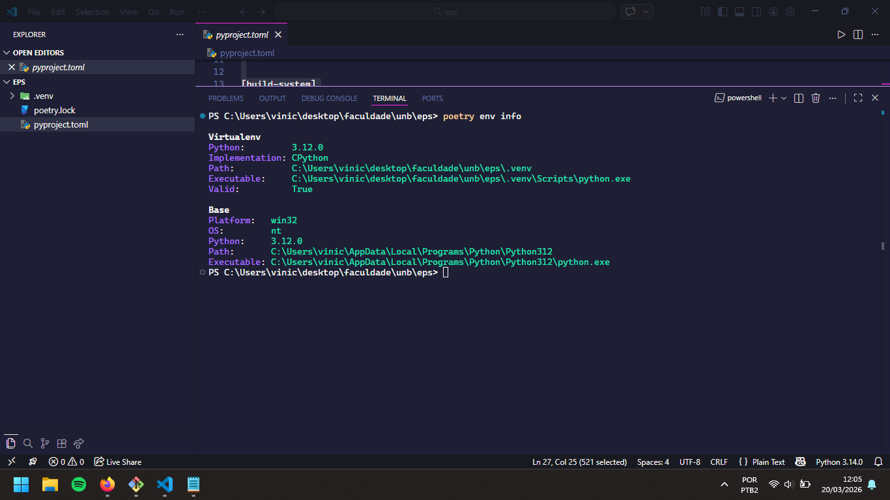
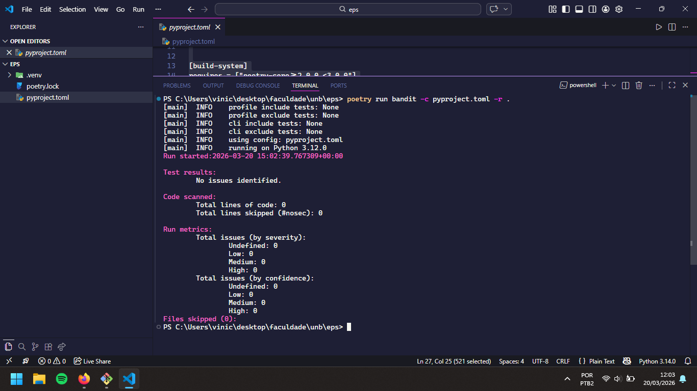
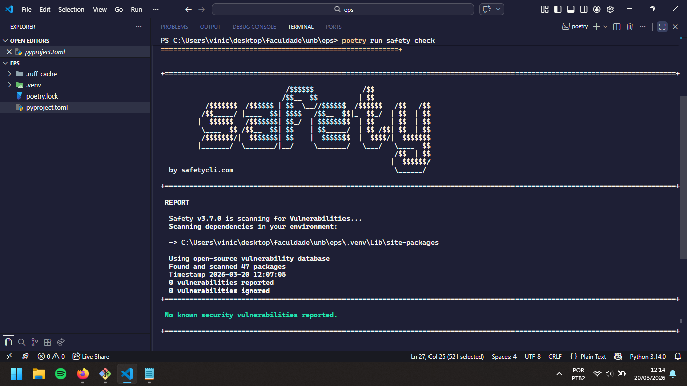
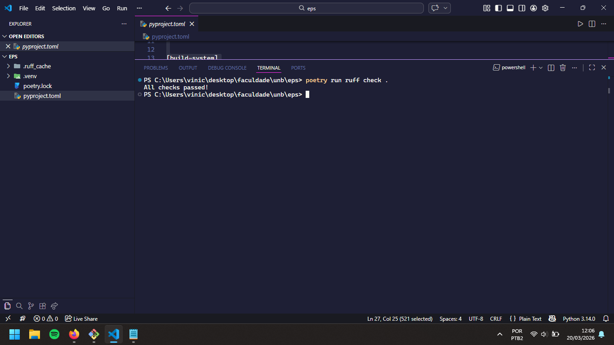

# Relatório de Prontidão Técnica: Onboarding SecOps

**Disciplina:** Engenharia de Produto de Software (FGA0316) - 2026.1
**Aluno:** Vinícius de Oliveira Santos | **Matrícula:** 202017263

## 1. Configuração do Ambiente (Zero Trust & Isolamento)
Conforme as diretrizes de Soberania Técnica, as seguintes configurações foram aplicadas:
- [ x ] **Python 3.12:** Instalado e verificado.
- [ x ] **Poetry:** Configurado para criar `.venv` dentro do projeto (`virtualenvs.in-project true`).
- [ x ] **Determinismo:** Arquivos `pyproject.toml` e `poetry.lock` gerados com sucesso.

## 2. Logs de Auditoria e Qualidade (Security Gate)
Abaixo constam os resumos das execuções dos comandos de segurança:

### 2.1. Auditoria Estática (Bandit)

### 2.2. Verificação de Dependências (Safety)

### 2.3. Qualidade e Conformidade (Ruff)

## 3. Evidência de Integração Contínua (CI)
O pipeline automatizado foi executado com sucesso no GitHub Actions:

- **Link da Action de Sucesso:** [Github Actions](https://github.com/ViniciussdeOliveira/pcdf-secops/actions)

## 4. Declaração de Soberania Técnica (CISSP Domain 8)
Eu, Vinícius de Oliveira Santos, declaro que auditei manualmente as ferramentas e dependências deste projeto. Confirmo que o código gerado via IA (GitHub Copilot) passou pela minha revisão humana (*Human-in-the-loop*), garantindo que não há vazamento de segredos ou falhas lógicas críticas antes da migração para o ecossistema da PCDF.

---
**Data de Entrega:** 21/03/2026